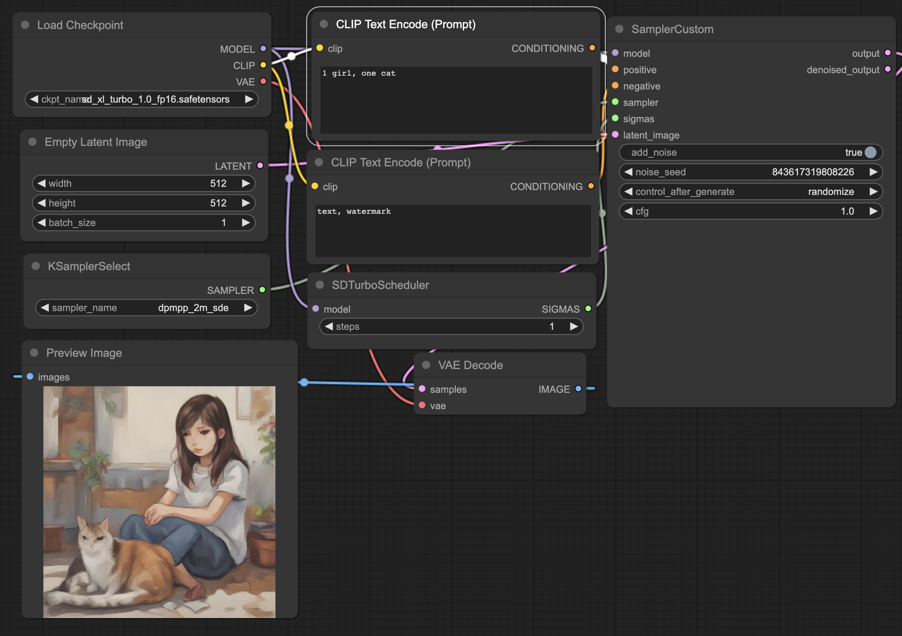

# comfyui-workflow Usage
Download following JSON files and load it in ComfyUI 
 
## Txt2Img
### SDXL Turbo
[use_sdxl_turbo.json](src/txt2img/use_sdxl_turbo.json) : use sdxl turbo model as checkpoint  
[sdxl_turbo_lora.json](src/txt2img/sdxl_turbo_lora.json) : use sdxl turbo lora and sdxl based model as checkpoint  
### Base usage
[add_lora.json](src/txt2img/add_lora.json)  
[refiner.json](src/txt2img/refiner.json)  
[refiner_lora.json](src/txt2img/refinder_lora.json)  
## Img2Img
### add expression for role
[add_expression.json](src/img2img/add_expression.json)   
## Txt2Gif
use animatediff 
